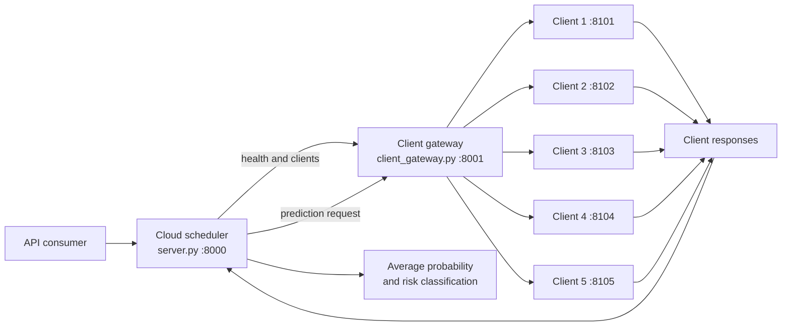

# CloudScheduleAI

> A distributed heart-disease risk prediction prototype built around a scheduler, a client gateway, and multiple independent prediction clients.

CloudScheduleAI demonstrates how a central service can discover available prediction clients, distribute a patient request, and combine the returned probabilities into one risk assessment. The project is designed as a local multi-service prototype and can later be extended with remote clients, stronger scheduling policies, authentication, and production model serving.

## Table of Contents

- [Overview](#overview)
- [Purpose](#purpose)
- [Features](#features)
- [Architecture](#architecture)
- [Technology Stack](#technology-stack)
- [Project Structure](#project-structure)
- [Prerequisites](#prerequisites)
- [Installation](#installation)
- [Running the Project](#running-the-project)
- [Using the API](#using-the-api)
- [Training a Client Model](#training-a-client-model)
- [Configuration](#configuration)
- [Useful Tips](#useful-tips)
- [Current Limitations](#current-limitations)
- [Conclusion](#conclusion)
- [Support](#support)

## Overview

The system contains three logical layers:

1. **Cloud scheduler (`server.py`)** checks the gateway, selects available clients, requests predictions, and prepares the final response.
2. **Client gateway (`client_gateway.py`)** tracks the five registered clients and forwards health checks and prediction requests.
3. **Prediction clients (`client_1` through `client_5`)** expose Flask endpoints. Their `prediction.py` and `trained.py` modules contain the XGBoost training and inference utilities.

The server uses a default risk threshold of `0.5`. It currently combines successful client probabilities with a simple average and reports either `HIGH RISK` or `LOW RISK`.

## Purpose

This project is intended for learning and prototyping distributed machine-learning workflows. It shows how multiple local or remote model owners can participate in a prediction request without requiring the scheduler to know the internal implementation of every client model.

This is **not a medical diagnostic system**. Predictions are experimental outputs and must not be used as a substitute for advice from a qualified healthcare professional.

## Features

| Feature | Description |
| --- | --- |
| Client discovery | Checks the health of all registered clients through the gateway. |
| Scheduling | Selects up to five online clients for a prediction request. |
| Distributed inference | Sends one patient payload to each participating client. |
| Result aggregation | Calculates a simple average probability across successful responses. |
| Risk classification | Converts the final probability into `HIGH RISK` or `LOW RISK`. |
| Health endpoints | Provides health checks for the scheduler, gateway, and every client. |
| XGBoost utilities | Includes training, scaling, evaluation, and inference helpers for client models. |
| Training artifacts | Saves model, scaler, metadata, and evaluation plots inside each client's `train/` folder. |
| Partial availability | Continues with available clients and reports failed or offline clients. |

## Architecture



### Request lifecycle

1. A consumer sends patient data to `POST /predict` on port `8000`.
2. The scheduler checks the gateway health endpoint.
3. The gateway checks all registered client health endpoints.
4. The scheduler selects the available clients, up to `MAX_CLIENTS`.
5. The gateway forwards the patient payload to each selected client.
6. The scheduler averages successful probabilities and applies `RISK_THRESHOLD`.
7. The server returns scheduler status, individual client predictions, and aggregation details.

## Technology Stack

| Layer | Technology | Role |
| --- | --- | --- |
| Language | Python 3.10+ | Application and machine-learning code |
| API services | Flask | Scheduler, gateway, and client HTTP APIs |
| Async networking | HTTPX | Scheduler-to-gateway asynchronous requests |
| HTTP forwarding | Requests | Gateway-to-client requests |
| Machine learning | XGBoost | Binary heart-disease classification |
| Data processing | pandas, NumPy | Dataset loading and feature preparation |
| Preprocessing | scikit-learn | Train/test split, scaling, and metrics |
| Class balancing | imbalanced-learn / SMOTE | Balances training data |
| Model persistence | joblib and XGBoost JSON | Saves scalers, metadata, and models |
| Evaluation charts | Matplotlib | Confusion matrix, precision-recall, and feature plots |

## Project Structure

```text
CloudSheduleAI_diseasePrediction/
├── server.py                 # Main cloud scheduler API (:8000)
├── scheduler.py              # Gateway checks and client selection logic
├── aggregator.py             # Average, weighted average, and classification logic
├── client_gateway.py         # Gateway API and client request forwarding (:8001)
├── requirements.txt          # Python dependencies
├── client_1/                 # Client API, dataset, model, and training utilities
│   ├── client_api.py         # Client HTTP API (:8101)
│   ├── prediction.py         # Model loading and inference helpers
│   ├── trained.py            # XGBoost training pipeline
│   ├── data/                 # Client-local dataset
│   └── train/                # Model and generated training artifacts
├── client_2/ ... client_5/   # Additional client services (:8102-:8105)
└── .venv/                    # Local virtual environment (ignored by Git)
```

## Prerequisites

- Windows, macOS, or Linux
- Python 3.10 or newer
- `pip`
- Seven terminal sessions if all services are run simultaneously
- Optional: Cloudflare Quick Tunnel or another public URL when the scheduler and gateway run on different machines

## Installation

From the project root:

### Windows PowerShell

```powershell
py -3 -m venv .venv
Set-ExecutionPolicy -Scope Process -ExecutionPolicy RemoteSigned
.\.venv\Scripts\Activate.ps1
python -m pip install --upgrade pip
python -m pip install -r requirements.txt
```

### macOS/Linux

```bash
python3 -m venv .venv
source .venv/bin/activate
python -m pip install --upgrade pip
python -m pip install -r requirements.txt
```

## Running the Project

Start the services in separate terminals. Activate `.venv` in each terminal first.

### 1. Start the five clients

```powershell
python .\client_1\client_api.py
python .\client_2\client_api.py
python .\client_3\client_api.py
python .\client_4\client_api.py
python .\client_5\client_api.py
```

The clients listen on ports `8101` through `8105`.

### 2. Start the gateway

```powershell
python .\client_gateway.py
```

The gateway listens on `http://127.0.0.1:8001`.

### 3. Configure and start the scheduler

For a fully local run, set `GATEWAY_URL` in `server.py` to:

```python
GATEWAY_URL = "http://127.0.0.1:8001"
```

Then start the scheduler:

```powershell
python .\server.py
```

The scheduler listens on `http://127.0.0.1:8000`.

The checked-in server configuration contains a Cloudflare Quick Tunnel URL. Replace it with the active tunnel URL when the gateway is hosted remotely.

## Using the API

### Service health

```powershell
curl http://127.0.0.1:8000/health
curl http://127.0.0.1:8001/health
curl http://127.0.0.1:8001/clients
```

### Submit a prediction

The current client API accepts JSON and returns a temporary test probability. This minimal request is enough to exercise the complete orchestration flow:

```powershell
curl -X POST http://127.0.0.1:8000/predict `
  -H "Content-Type: application/json" `
  -d '{"age": 55, "Maximum Heart Rate": 140, "Cholesterol Level": 220}'
```

A successful response contains scheduler status, individual client results, and aggregation details similar to:

```json
{
  "status": "success",
  "scheduler": {
    "selected_clients": ["client_1", "client_2"],
    "successful_clients": ["client_1", "client_2"]
  },
  "aggregation": {
    "method": "simple_average",
    "probability": 0.82,
    "percentage": 82.0,
    "threshold": 0.5,
    "risk": "HIGH RISK"
  }
}
```

The exact client list depends on which services are online. Individual prediction records are populated from the live gateway response.

## Training a Client Model

Each client with a dataset includes a training script. For example:

```powershell
python .\client_1\trained.py
```

Training performs an 80/20 stratified split, standardizes features, applies SMOTE, trains an XGBoost classifier, evaluates it, and writes artifacts to `client_1/train/`.

The inference helper can also train automatically when model artifacts are missing:

```powershell
python .\client_1\prediction.py
```

The feature definitions differ by dataset. Client 1 uses features such as `chest pain`, `Maximum Heart Rate`, `age`, and `Cholesterol Level`. Client 5 uses features such as `Age`, `Gender`, `Smoking`, `Diabetes`, and `Chest Pain Type`. Check the selected client's `prediction.py` before sending a model-specific payload.

## Configuration

| Setting | File | Default | Meaning |
| --- | --- | --- | --- |
| Gateway URL | `server.py` | Quick Tunnel URL | Address used by the scheduler to reach the gateway |
| Maximum clients | `server.py` | `5` | Upper bound for participating clients |
| Risk threshold | `server.py` | `0.5` | Probability boundary for `HIGH RISK` |
| Client addresses | `client_gateway.py` | `127.0.0.1:8101-8105` | Registered client service locations |
| Gateway port | `client_gateway.py` | `8001` | Local gateway HTTP port |
| Scheduler port | `server.py` | `8000` | Main API HTTP port |

## Useful Tips

- Start clients before the gateway and start the gateway before the scheduler.
- Use `GET /clients` to diagnose missing or offline clients before testing `/predict`.
- Keep each service in its own terminal so startup logs remain readable.
- If PowerShell blocks activation, run `Set-ExecutionPolicy -Scope Process -ExecutionPolicy RemoteSigned` in that terminal only.
- Training artifacts can be regenerated by running the relevant `trained.py` script.
- Do not commit `.venv/`, generated plots, or private tunnel URLs.
- When changing ports, update both `client_gateway.py` and the corresponding client API.
- Treat model probabilities as experimental until the client APIs call their real inference functions.

## Current Limitations

- The five `client_api.py` files currently return a hard-coded probability of `0.82`; they do not yet call their XGBoost `prediction.py` helpers.
- `server.py` contains a checked-in Cloudflare tunnel URL that must be replaced for local or new remote deployments.
- All clients currently receive equal aggregation weight.
- There is no authentication, encryption policy, request validation schema, persistence, or production process manager.
- `asyncio.run()` is called inside Flask request handlers, which is adequate for this prototype but should be revisited for a production async deployment.

## Conclusion

CloudScheduleAI provides a compact foundation for federated-style, multi-client heart-disease prediction experiments. Its service boundaries make it easy to replace mock client responses with real model inference, move clients to separate hosts, and evolve the aggregation and scheduling strategies independently.

## Support

This workspace does not include a public issue tracker or maintainer email address. For support, open an issue in the repository where this project is hosted and include:

- Operating system and Python version
- The command that failed
- The relevant service logs
- The endpoint and HTTP status code
- Whether the gateway and all expected clients were online

For medical interpretation, contact a qualified healthcare professional rather than using this software as a diagnostic authority.